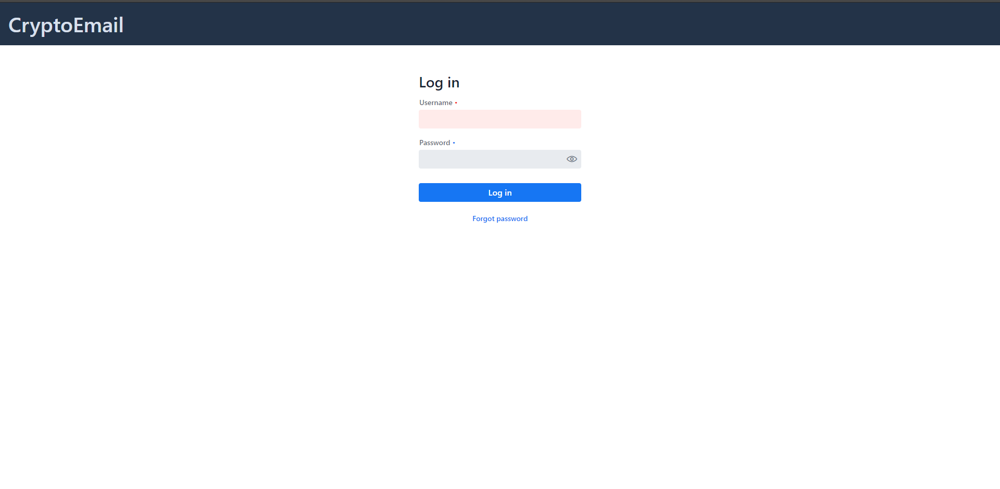
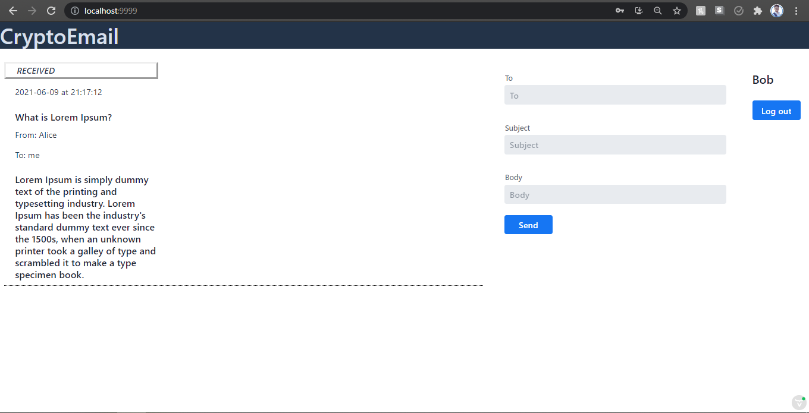

# Project Base for Vaadin and Spring Boot

This is a simple chat room where different userrs (more than 2) can chat in the same room. in case of one user joined late, he/she can see the last 30 messages.

## Running the Application

There are two ways to run the application : using `mvn spring-boot:run` or by running the `Application` class directly from your IDE.

You can use any IDE of your preference,but we suggest Eclipse or Intellij IDEA.
Below are the configuration details to start the project using a `spring-boot:run` command. Both Eclipse and Intellij IDEA are covered.

#### Eclipse

- Right click on a project folder and select `Run As` --> `Maven build..` . After that a configuration window is opened.
- In the window set the value of the **Goals** field to `spring-boot:run`
- You can optionally select `Skip tests` checkbox
- All the other settings can be left to default

Once configurations are set clicking `Run` will start the application

#### Intellij IDEA

- On the right side of the window, select Maven --> Plugins--> `spring-boot` --> `spring-boot:run` goal
- Optionally, you can disable tests by clicking on a `Skip Tests mode` blue button.

Clicking on the green run button will start the application.

After the application has started, you can view your it at http://localhost:555/ in your browser.

If you want to run the application locally in the production mode, use `spring-boot:run -Pproduction` command instead.

### Running Integration Tests

Integration tests are implemented using [Vaadin TestBench](https://vaadin.com/testbench). The tests take a few minutes to run and are therefore included in a separate Maven profile. We recommend running tests with a production build to minimize the chance of development time toolchains affecting test stability. To run the tests using Google Chrome, execute

`mvn verify -Pit,production`

and make sure you have a valid TestBench license installed.

Profile `it` adds the following parameters to run integration tests:

```sh
-Dwebdriver.chrome.driver=path_to_driver
-Dcom.vaadin.testbench.Parameters.runLocally=chrome
```

If you would like to run a separate test make sure you have added these parameters to VM Options of JUnit run configuration

## Project overview

Project follow the Maven's [standard directory layout structure](https://maven.apache.org/guides/introduction/introduction-to-the-standard-directory-layout.html):

- Under the `srs/main/java` are located Application sources
  - `Application.java` is a runnable Java application class and a starting point
  - `GreetService.java` is a Spring service class
  - `MainView.java` is a default view and entry point of the application
- Under the `srs/test` are located test files
- `src/main/resources` contains configuration files and static resources
- The `frontend` directory in the root folder contains client-side dependencies and resource files
  - All CSS styles used by the application are located under the root directory `frontend/styles`
  - Templates would be stored under the `frontend/src`

## More Information and Next Steps

- Vaadin Basics [https://vaadin.com/docs](https://vaadin.com/docs)
- More components at [https://vaadin.com/components](https://vaadin.com/components) and [https://vaadin.com/directory](https://vaadin.com/directory)
- Download this and other examples at [https://vaadin.com/start](https://vaadin.com/start)
- Using Vaadin and Spring [https://vaadin.com/docs/v14/flow/spring/tutorial-spring-basic.html](https://vaadin.com/docs/v14/flow/spring/tutorial-spring-basic.html) article
- Join discussion and ask a question at [https://vaadin.com/forum](https://vaadin.com/forum)

## Notes

If you run application from a command line, remember to prepend a `mvn` to the command.


## Example

**This is the login page:**


--------------------------------------------------------------------------------------------------------------------------------------------------------------------
##

**After sending the message from Alice to Bob, this is what will be seen on Alice's screen:**
 

--------------------------------------------------------------------------------------------------------------------------------------------------------------------
##

**After sending the message from Alice to Bob, this is what will be seen on Bob's screen:**


